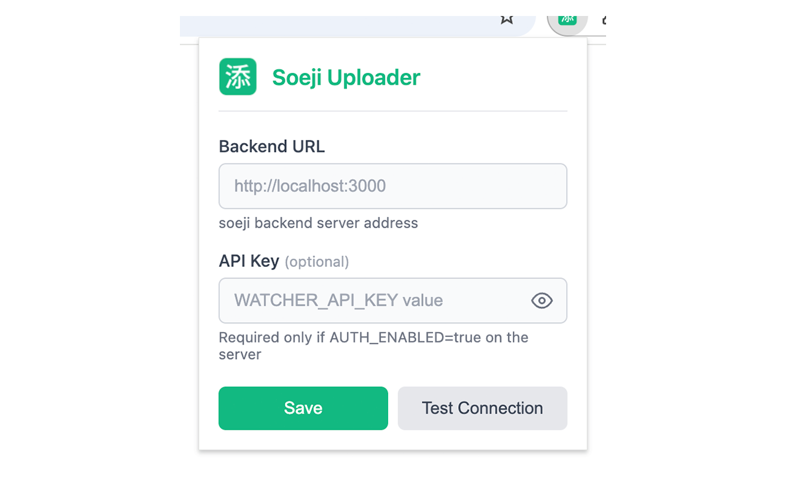
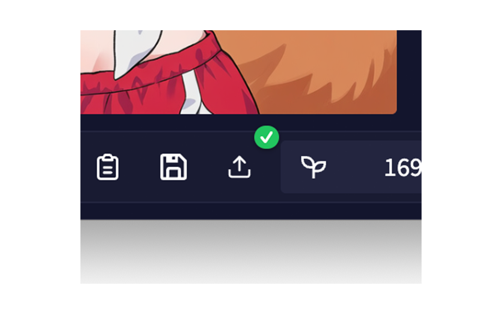

# Soeji Uploader for NAI

NAI で生成した画像を直接 soeji にアップロードするブラウザ拡張機能です。

[](https://chromewebstore.google.com/detail/soeji-uploader-for-nai/boaolindibeokfkjfkhlgkfkgcmelnfn) [](https://addons.mozilla.org/ja/firefox/addon/soeji-uploader-for-nai/)





## 機能

- NAI の画像生成画面にアップロードボタンを追加
- ワンクリックで soeji バックエンドに画像をアップロード
- アップロード状態をバッジで表示（アップロード中・成功・重複・エラー）
- Chrome / Firefox 両対応

## インストール

### 開発版のインストール

#### Chrome

1. `chrome://extensions/` を開く
2. 「デベロッパーモード」を有効化
3. 「パッケージ化されていない拡張機能を読み込む」をクリック
4. `browser-extension` ディレクトリを選択

#### Firefox

1. `about:debugging#/runtime/this-firefox` を開く
2. 「一時的なアドオンを読み込む」をクリック
3. `browser-extension/manifest.json` を選択

### web-ext を使用した開発

```bash
cd browser-extension
npm install
npm run dev:firefox  # Firefox で開発
npm run dev:chrome   # Chrome で開発
```

## 設定

1. ブラウザのツールバーにある Soeji アイコンをクリック
2. **Backend URL**: soeji バックエンドのアドレスを入力（例: `http://localhost:3000`）
3. **API Key**: `WATCHER_API_KEY` の値を入力（サーバーで `AUTH_ENABLED=true` の場合のみ必要）
4. 「Save」をクリックして保存
5. 「Test Connection」で接続確認

## 使い方

1. NAI で画像を生成
2. 生成された画像の下に表示されるアップロードボタン（↑アイコン）をクリック
3. アップロード状態がボタン右上のバッジに表示される
   - 青（スピナー）: アップロード中
   - 緑（✓）: 成功
   - 黄（=）: 既にライブラリに存在
   - 赤（!）: エラー

## 開発

### ディレクトリ構成

```
browser-extension/
├── manifest.json              # 拡張機能マニフェスト (MV3)
├── background.js              # Service Worker (設定管理)
├── content-scripts/
│   ├── novelai.js             # NAI用コンテンツスクリプト
│   └── novelai.css            # ボタン・バッジスタイル
├── popup/
│   ├── popup.html             # 設定ポップアップ
│   ├── popup.js               # 設定ロジック
│   └── popup.css              # ポップアップスタイル
├── assets/
│   └── icons/                 # 拡張機能アイコン
├── package.json
└── web-ext-config.mjs
```

### ビルド

```bash
# パッケージ作成（Chrome / Firefox 両対応）
npm run build
```

`web-ext-artifacts/` ディレクトリに zip ファイルが生成されます。
Manifest V3 形式のため、同一パッケージで Chrome Web Store と Firefox Add-ons の両方に対応しています。

## 技術仕様

### 認証

- ヘッダー: `X-Watcher-Key: {WATCHER_API_KEY}`
- watcher と同じ認証方式を使用
- `AUTH_ENABLED=false` の場合は API Key 不要

### アップロード API

- エンドポイント: `POST {backendUrl}/api/upload`
- ボディ: `multipart/form-data`（フィールド名: `file`）
- レスポンス:
  - 成功: `{ success: true, image: {...} }`
  - 重複: `{ success: true, duplicate: true, existingImage: {...} }`
  - エラー: `{ success: false, error: "..." }`

### ブラウザ互換性

- Manifest V3 使用
- Chrome: `service_worker` で background.js を読み込み
- Firefox: `scripts` で background.js を読み込み（142.0以降）
- `chrome.storage.local` でクロスブラウザ対応
- Content script から直接アップロード（CORS 経由）
- Firefox Add-ons 向けに `data_collection_permissions` 設定済み

## ライセンス

MIT
